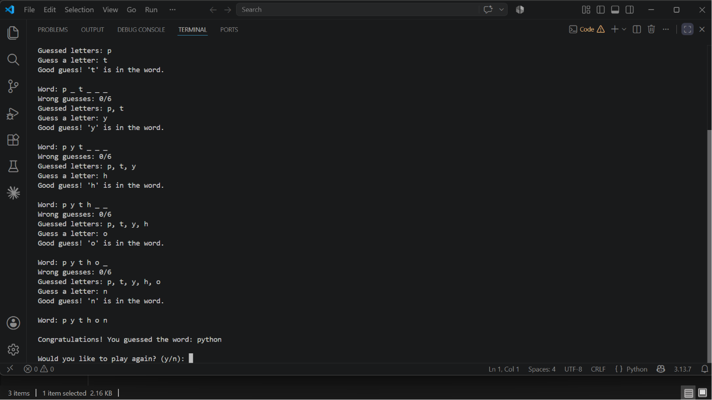
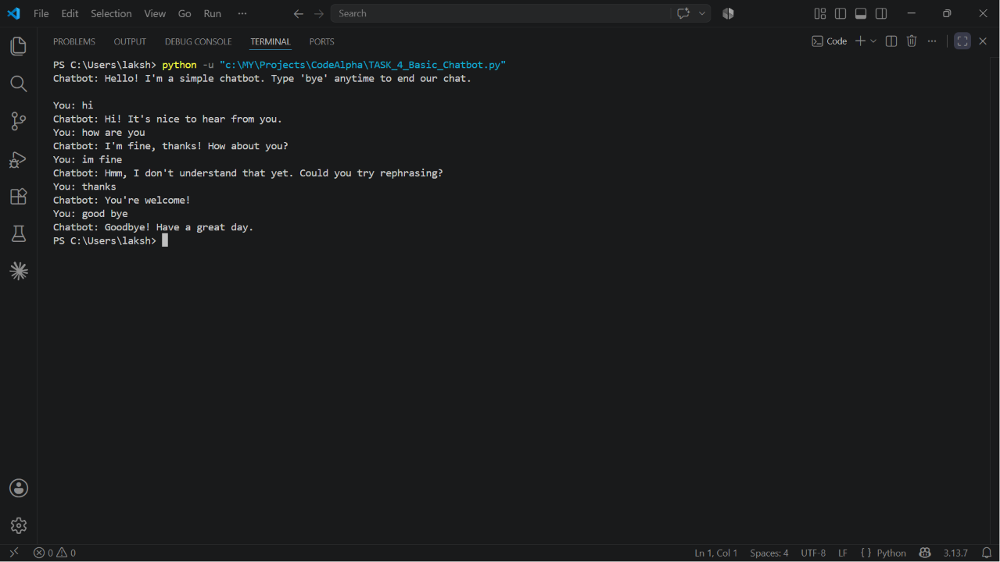

# CodeAlpha Python Internship

This repository contains all the tasks completed during my CodeAlpha Python Programming Internship.

## Tasks

### Task 1 - Hangman Game
- Language: Python
- Concepts Used:
  - Random Module
  - Loops
  - Functions
  - Conditional Statements

### Task 4 - Basic Chatbot
- Language: Python
- Concepts Used:
  - Functions
  - String Handling
  - Conditional Statements
## 📂 Tasks Completed

### ✅ Task 1 - Hangman Game

A command-line Hangman game developed using Python.

#### Output

---

### ✅ Task 4 - Basic Chatbot

A simple chatbot developed using Python.

#### Output

## Author
Mahalakshminish Singh
B.Tech AI & ML
